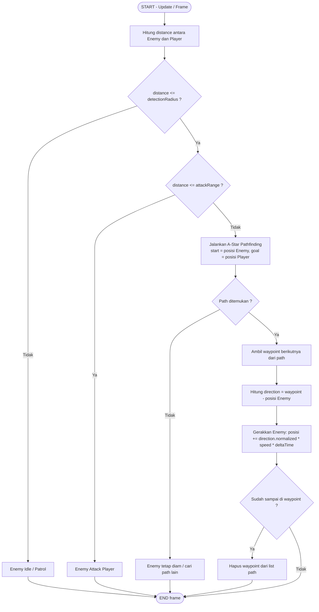

# Flowchart — Enemy Detection, Pathfinding & Movement

### Penjelasan Tiap Blok
1. **Hitung distance** — jarak Euclidean `sqrt((px-ex)^2 + (py-ey)^2)`.
2. **Cek detectionRadius** — menentukan apakah player berada dalam jangkauan penglihatan/pendengaran enemy.
3. **Cek attackRange** — jika sudah sangat dekat, enemy tidak perlu pathfinding lagi, langsung menyerang.
4. **A\* Pathfinding** — mencari jalur terpendek dari posisi enemy ke posisi player melewati grid dungeon (menghindari tembok/obstacle).
5. **Movement (Seek)** — enemy bergerak waypoint demi waypoint mengikuti path yang dihasilkan A*, bukan bergerak lurus menembus tembok.
